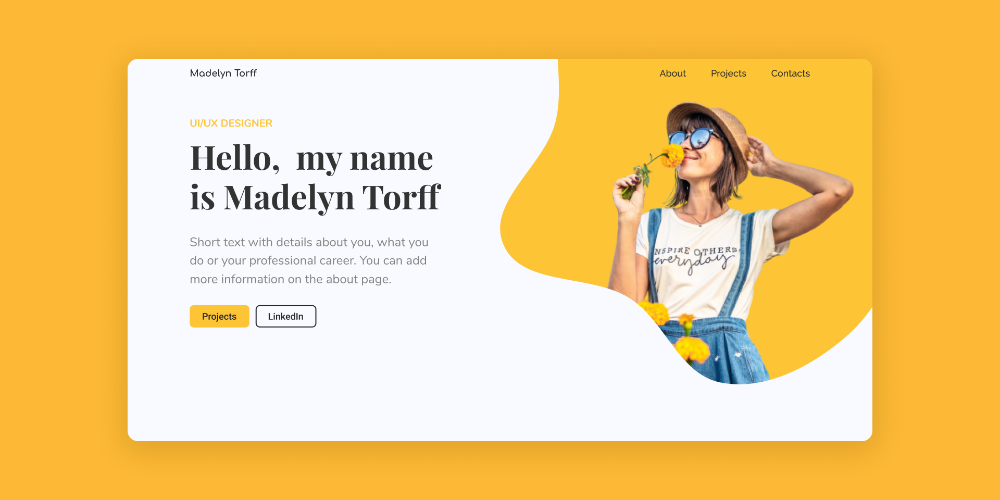

<br/>
<h1 align="center">
  Personal Portfolio
</h1>
<h2 align="center"> 


</h2>
<br>
<p align="center">
<a href="#-tecnologias-usadas">Tecnologias usadas</a>&nbsp;&nbsp;&nbsp;|&nbsp;&nbsp;&nbsp;
<a href="#-pré-requisitos">Pré-requisitos</a>&nbsp;&nbsp;&nbsp;|&nbsp;&nbsp;&nbsp;
<a href="#-como-rodar-o-projecto">Como rodar o projecto</a>
</p>
<p align="center">
    
</p>

<p align="center">
O <span>Personal Portfolio</span> é uma pagina de portfolio em que o visitante pode visual projectos e informações.


<!-- <h1 align="center"> 

<a href="https://expersonal-portifolio.vercel.app">Acessar demonstração</a>
</h1> -->


## 🛠 Tecnologias usadas

As seguintes ferramentas foram usadas na construção do projeto:


- Nextjs
- ReactJs
- Typescript
- Sass
- Framer Motion


---


## ⚠ Pré-requisitos

Antes de começar, você vai precisar ter instalado em sua máquina as seguintes ferramentas:
[Git](https://git-scm.com), [Node.js](https://nodejs.org/en/). 
Além disto é bom ter um editor para trabalhar com o código como [VSCode](https://code.visualstudio.com/)

---
## 🎲 Como rodar o projecto

```bash
# Clone este repositório
$ git clone <https://github.com/isaiasnhantumbo/personal-portifolio.git>

# Acesse a pasta do projeto no terminal/cmd
$ cd personal-portifolio

# Abra a pasta no Visual Studio Code
$ code .

# Instale as dependência
$ yarn

# Execute a aplicação com o yarn
$ yarn dev

# O servidor inciará na porta:3000 - acesse <http://localhost:3000>
```

---


## 📘 Licença
Este projecto usa a  [MIT License](LICENSE).
****

## 👩‍🎨 Layout
[Andressa Belém](https://www.figma.com/@anddesignland)

<h1 align="center">
👨🏽‍🏫 
<br>
Desenvolvido por
<br>
 Isaias Nhantumbo Junior
</h1>
</p>
<h1 align="center"> 🤝 &nbsp;Vamos nos conectar ?👨 </h1>

<h1 align="center">

[](https://www.linkedin.com/in/isaias-nhantumbo-junior-733bb619b)
[](https://www.instagram.com/isaias_nhantumbo/)
[](https://www.youtube.com/channel/UCOyeYkH0MwJ6RrXTcEFFdAQ?view_as=subscriber)

</h1>


